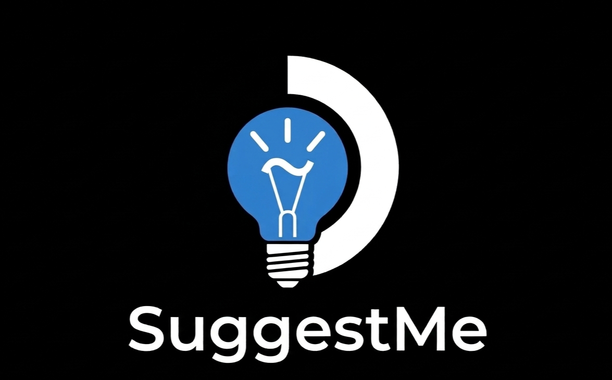

# SuggestMe




**Smart game suggestion from your Steam library, native to Steam Deck.**

SuggestMe is a Decky Loader plugin that helps you decide what game to play next from your Steam library. It analyzes your game collection, play patterns, and library metadata to suggest games based on different modes.

## Features

### Suggestion Modes
- **Luck** - Random pick from your filtered library
- **Guided** - Backlog clearing: least played games first
- **Intelligent** - Recommends games similar to your recent gaming habits (fully tunable)
- **Fresh Air** - Something different from what you usually play (fully tunable)

### Mode Tuning
Fine-tune how Intelligent and Fresh Air modes score games:
- **Intelligent Mode** - Adjust recent games count, most-played count, recency decay, genre/tag/community tag weights, unplayed bonus, and top candidate percentile
- **Fresh Air Mode** - Adjust genre/tag/community tag penalties, unplayed bonus, novel genre bonus, and top candidate percentile
- Community tags are now integrated into the preference profile and scoring for both modes

### Powerful Filtering Engine
- **Source** - Include or exclude Steam vs. Non-Steam games
- **Playtime** - Set minimum/maximum hours played, filter for unplayed games only, or toggle installed-only games
- **Genres** - Include or exclude official Steam genres (Action, RPG, Strategy, etc.) with search
- **Steam Features** - Include or exclude official features (Single-player, Multi-player, Steam Achievements, etc.) with search
- **Community Tags** - Filter by user-generated Steam community tags (Souls-like, Metroidvania, Roguelike, Open World, etc.) with search
- **Deck Compatibility** - Filter by Valve Deck Verified status or ProtonDB ratings
- **Collections** - Filter by your Steam user collections
- **Filter Presets** - Save up to 5 filter combinations and quickly switch between them from the main screen

### Non-Steam Games Support
- **Auto-detection** - Automatically detects Non-Steam games added to your library
- **Store matching** - Matches Non-Steam games with their Steam store equivalents to pull metadata (tags, genres, Deck status)
- **Status tracking** - Dedicated UI to view matched vs. unmatched games and manually trigger rescans
- **Unified sync** - Sync process handles both Steam and Non-Steam games in one go

### Intelligent Library Sync
- **Sleep-proof syncing** - Library sync saves progress periodically. If you exit the plugin or the Deck goes to sleep, the sync will resume from where it left off
- **Comprehensive metadata** - Fetches genres, categories, community tags, Valve Deck verification status, and ProtonDB ratings for every game

### History & UI Features
- **Track history** - Previously suggested games are tracked per-mode with quick actions to launch them
- **Play Next & Excluded Lists** - Add games to a queue to play later, or exclude games from ever being suggested
- **Steam Collections Integration** - Sync your Play Next queue and Excluded games directly to native Steam Collections
- **Steam UI integration** - "Launch Game" button takes you directly to the game's library page
- **Native feel** - Fast, native Decky UI with gamepad-friendly navigation
- **Easy setup** - Dedicated paste buttons for API key and Steam ID in settings

## Screenshots

<details>
<summary>📸 Click to view screenshots</summary>

*(Screenshots coming soon)*

</details>

## Installation

### From Decky Store
*Pending approval in the Decky Store.*

### Manual Installation
1. Download the latest release from the [Releases](https://github.com/lemossilva/suggestme-decky-plugin/releases) page
2. Open Decky Loader > Settings > Developer > "Install from Zip" > Select the Zip release file (not source code!).
3. Restart Decky Loader

## Setup (Required)

SuggestMe needs read-only access to your Steam library to analyze your games.

1. **Get your Steam Web API Key** at [steamcommunity.com/dev/apikey](https://steamcommunity.com/dev/apikey)
2. **Find your Steam ID 64** at [steamid.io](https://steamid.io/) (17-digit format)
3. Open the plugin on your Steam Deck and go to **Settings** (gear icon) -> **Credentials**.
4. Paste your API Key and Steam ID 64.
5. Go to the **Library** tab and click "**Sync Library**". The plugin will fetch your games and their metadata. This may take a few minutes for large libraries.

## Development

### Prerequisites

```bash
# Install Node.js 18+
curl -fsSL https://deb.nodesource.com/setup_18.x | sudo -E bash -
sudo apt-get install -y nodejs

# Install pnpm v9
sudo npm install -g pnpm@9

# Verify
node --version  # Should be 18.x+
pnpm --version  # Should be 9.x
```

### Building

```bash
# Install dependencies
pnpm install

# Build for production
pnpm run build

# Watch mode for development
pnpm run watch
```

### Deploying to Steam Deck

1. Enable SSH on your Steam Deck (Desktop Mode)
2. Deploy:
   ```bash
   ./deploy.sh 192.168.X.X
   ```

### CEF Debugging

1. Enable "Allow Remote CEF Debugging" in Decky Developer Settings
2. Open Chrome/Edge and go to `chrome://inspect`
3. Configure network target: `DECK_IP:8081`
4. Select "SharedJSContext" to debug

## Privacy

This plugin is **privacy-first** and prioritizes keeping your data safe:
- All data stays locally on your device
- No telemetry or external data sharing
- Steam API key is stored locally only
- Internet connection is only needed for the library sync and metadata fetching

## License

BSD-3-Clause License - See [LICENSE](LICENSE) for details.

## Credits

- **Author**: Guilherme Lemos
- **Framework**: [Decky Loader](https://github.com/SteamDeckHomebrew/decky-loader)
- **Icons**: [React Icons](https://react-icons.github.io/react-icons/)

## Support

If you encounter any issues, please [open an issue](https://github.com/lemossilva/suggestme-decky-plugin/issues) on GitHub.
